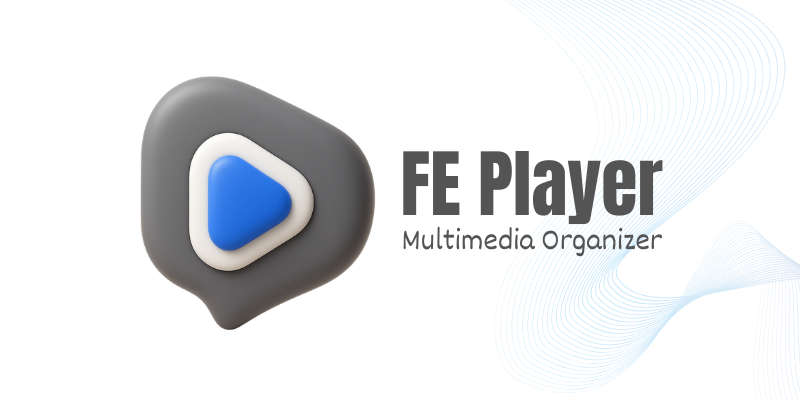

# FE Player - Multimedia Organizer 🎬

<p align="center">
  
</p>

<p align="center">
  <b>Clean Futuristic Glassmorphic Video Player & Local Media Organizer</b> built with Flutter & C++ (libmpv Hardware Acceleration Engine).
</p>

<p align="center">
  <a href="https://github.com/pabeledp/FEPlayer/raw/main/windows_installer_output/FEPlayer-Windows-Setup.exe">
    
  </a>
  &nbsp;&nbsp;
  <a href="https://github.com/pabeledp/FEPlayer/raw/main/apk_output/FEPlayer-Android.apk">
    
  </a>
  &nbsp;&nbsp;
  <a href="https://github.com/pabeledp/FEPlayer/raw/main/dmg_output/FEPlayer-macOS.dmg">
    
  </a>
</p>

---

## 📥 Direct Downloads

| Platform | Download Link | Package Type | Features |
| :--- | :--- | :--- | :--- |
| 🪟 **Windows** | [**Download FEPlayer-Windows-Setup.exe**](https://github.com/pabeledp/FEPlayer/raw/main/windows_installer_output/FEPlayer-Windows-Setup.exe) | `.exe` Setup Wizard | Single double-clickable installer, Program Files installation, Desktop & Start Menu shortcuts, Acrylic blur, 60fps libmpv hardware engine |
| 🤖 **Android** | [**Download FEPlayer-Android.apk**](https://github.com/pabeledp/FEPlayer/raw/main/apk_output/FEPlayer-Android.apk) | `.apk` Package | Touch gesture controls, System volume & audio_service notification integration, Subtitle picker |
| 🍏 **macOS** | [**Download FEPlayer-macOS.dmg**](https://github.com/pabeledp/FEPlayer/raw/main/dmg_output/FEPlayer-macOS.dmg) | `.dmg` Installer | Full 4K 60fps hardware acceleration, Acrylic Glass blur, Frameless drag, Touch Gestures |

---

## 💎 Design System & UX Highlights

* **Aesthetic**: Clean White / Light Mode base with a futuristic glassmorphism style.
* **Background & Panels**: Frosted white acrylic glass (`#F8FAFC` at `0.75` opacity) with blur filters (`BackdropFilter` sigma 16), subtle border strokes (`#E2E8F0` at `0.5` opacity), and soft drop shadows.
* **Accent & Highlights**: Electric Blue (`#2563EB` / `#3B82F6`) for active states, timeline scrub fills, and glowing button effects.
* **Sticky Brand Header**: Pinned brand header with official 3D logo banner that remains visible during scrolling.

---

## 🏗️ System Architecture & Codebase Structure

```
FEPlayer/
├── assets/
│   ├── icons/            # 3D Official App Icons (app_logo.png)
│   └── images/           # Official Brand Banner (fe_player_banner.png)
├── lib/
│   ├── main.dart         # Entry point, WindowManager, Acrylic blur, AudioService init
│   └── src/
│       ├── constants/    # Theme definitions, Frosted Glass glassmorphism styles
│       ├── controllers/  # State Management (Provider)
│       │   ├── player_controller.dart     # libmpv engine playback & controls state
│       │   ├── library_controller.dart    # Storage scanning, folder filtering & media state
│       │   ├── downloader_controller.dart # Video downloader & local file wiring
│       │   └── fe_audio_handler.dart      # Lockscreen & notification media controls
│       ├── models/       # Data models for media files & download items
│       ├── ui/           # Screens (HomeScreen, PlayerScreen, DownloaderScreen, SettingsScreen)
│       └── widgets/      # UI Components (CustomTitleBar, GlassCard, TimelineScrubber, VideoViewport)
├── windows/              # C++ Native Runner & Manifests
├── installer.iss         # Inno Setup 6 Installer compiler script
└── windows_installer_output/ # Compiled double-clickable setup executable (FEPlayer-Windows-Setup.exe)
```

---

## 📖 User Manual & How to Use

### 1. Installation Guide
* **Windows**: Download `FEPlayer-Windows-Setup.exe`, double-click to launch the setup wizard, follow the steps to install into `Program Files`, and launch via Desktop/Start Menu shortcut.
* **Android**: Download `FEPlayer-Android.apk`, open on your Android device, grant file storage permissions, and install.

### 2. Media Library & Storage Auto-Scan
* Launching the app automatically scans local device storage for videos and media files.
* Click **"Scan Media"** in the top header to manually refresh local storage.
* Click **"Import File"** to pick any video/audio file directly from your file manager.

### 3. Video Playback & Micro-Interactions
* **Play / Pause**: Click screen or press `Space`.
* **Seek / Rewind**: Use `Left / Right Arrow` or double-tap left/right side of video viewport.
* **Volume Control**: Scroll mouse wheel or use `Up / Down Arrow` with animated glass HUD badge.
* **Dual Audio Tracks & Subtitles**: Click the Audio/Subtitle dialog icon to switch audio languages or import external `.srt` / `.vtt` subtitles.

### 4. Keyboard Shortcuts Summary
| Key | Action |
| :--- | :--- |
| `Space` | Play / Pause toggle |
| `Up / Down Arrow` | Volume adjust (±5%) + Glass HUD |
| `Left / Right Arrow` | Seek 5 seconds (±5s) |
| `M` | Mute / Unmute |
| `F` or `F11` | Toggle Fullscreen |
| `L` | Open Media Library Drawer |

---

## 🚀 Building from Source

### Windows Setup Installer (`.exe`)
```powershell
flutter pub get
flutter build windows --release
& "$env:LOCALAPPDATA\Programs\Inno Setup 6\ISCC.exe" installer.iss
```

### Android APK (`.apk`)
```bash
flutter build apk --release
```

### macOS DMG (`.dmg`)
```bash
./build_dmg.sh
```
